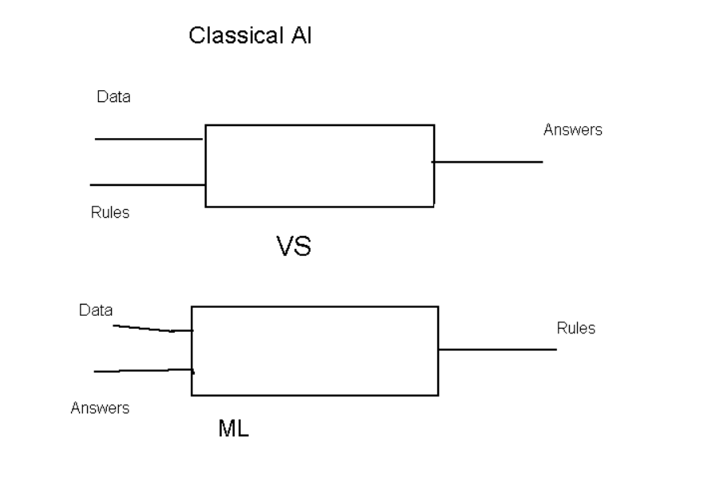
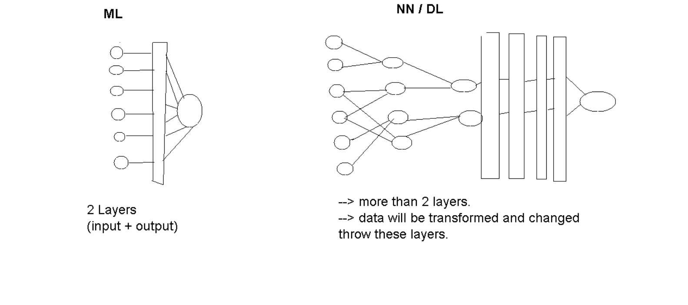

<h1>Intro to AI and ML</h1>
<ul>
    <li>
    AI : is the effort to automate intellenctual tasks normally perfomed by humans.
    </li>
    <li>
    Evaluation
    </li>
    <ol>
        <li>
            <strong>1950</strong> : The question is can computers think?
             --> back than AI was just a simple set of rules like : AI plays tic tac toe it was bunch of set of <strong>if else</strong> statements.
             
             
            <strong style="color:orange;border:1px solid black; display: grid;place-items: center;">
                    NB : AI can be simple or small !
            </strong>
             
            Well today AI is more evolved and developed Which bring us to this :
             
             
            
             
             
            <strong >++ So what is ML ?</strong>
        </li>
             
        <li>
            <strong>ML:</strong>
             --> Ml unlike AI it tries to figure out the rules for us. with a defined <strong>data-set</strong>.        
            </li>
             
             
            
              
            <strong style="color:orange;border:1px solid black; display: grid;place-items: center;">
                    NB : Rather than giving the program the rules and ML algorithm finds the rules for us by using NN or some defined algorithms.
            </strong>
              
            <strong>++ So what is NN ? </strong>
        </li>
             
             
        <li>
            <strong>NN:</strong>
             A neural network is a form of ML that uses a layered representations of data.
             
             
            
             
             
            --> NN is a mulity stage information extarction process. 
            we have our data at the first layer, which is that input information, which we're going to pass to the Model and than goes to an other layer, where it can be transformed and changed to something else using some set of "rules".
              
            <strong style="color:orange;border:1px solid black; display: grid;place-items: center;">
                    Exp : A DL model to define an animal, that takes an image as an input, than it will re render it on black and white than figure out what that animal is.
            </strong>
             
            <strong style="color:orange;border:1px solid black; display: grid;place-items: center;">
                    NB : NN is not modeled after the human brain !
            </strong>
              
        </li>
    </ol>
</ul>