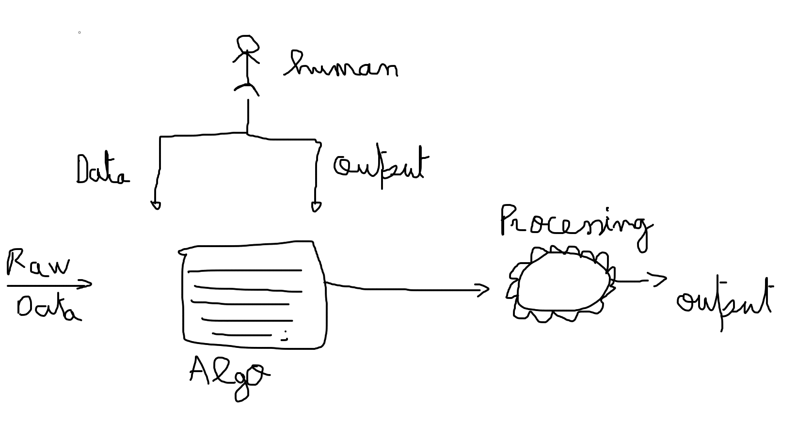

<h1>Intro to AI and ML</h1>
<ul>
    <li>
    AI : is the effort to automate intellenctual tasks normally perfomed by humans.
    </li>
    <li>
    Evaluation
    </li>
    <ol>
        <li>
            <strong>1950</strong> : The question is can computers think?
             --> back than AI was just a simple set of rules like : AI plays tic tac toe it was bunch of set of <strong>if else</strong> statements.
             
             
            <strong style="color:orange;border:1px solid black; display: grid;place-items: center;">
                    NB : AI can be simple or small !
            </strong>
             
            Well today AI is more evolved and developed Which bring us to this :
             
             
            
             
             
            <strong >++ So what is ML ?</strong>
        </li>
             
        <li>
            <strong>ML:</strong>
             --> Ml unlike AI it tries to figure out the rules for us. with a defined <strong>data-set</strong>.        
            </li>
             
             
            
              
            <strong style="color:orange;border:1px solid black; display: grid;place-items: center;">
                    NB : Rather than giving the program the rules and ML algorithm finds the rules for us by using NN or some defined algorithms.
            </strong>
              
            <strong>++ So what is NN ? </strong>
        </li>
             
             
        <li>
            <strong>NN:</strong>
             A neural network is a form of ML that uses a layered representations of data.
             
             
            
             
             
            --> NN is a mulity stage information extarction process. 
            we have our data at the first layer, which is that input information, which we're going to pass to the Model and than goes to an other layer, where it can be transformed and changed to something else using some set of "rules".
              
            <strong style="color:orange;border:1px solid black; display: grid;place-items: center;">
                    Exp : A DL model to define an animal, that takes an image as an input, than it will re render it on black and white than figure out what that animal is.
            </strong>
             
            <strong style="color:orange;border:1px solid black; display: grid;place-items: center;">
                    NB : NN is not modeled after the human brain !
            </strong>
              
            <strong>++Data data so what i mean by data?</strong>
        </li>
         
         
        <li>
            <strong>Data</strong>
            To make things clear data and your data-set is the most important thing to make a good ML/DL model.
             
             
            --> Example of a data-set:
             
             
            
             
            for example if we had a student's MID 1 and FINAL how can we predict the MID2
            <strong style="color:orange;border:1px solid black; display: grid;place-items: center;">
                    NB :  
                    **Input data called features.**  
                    **Output data called labels.**
            </strong>
             
            --> In this case MID1 and FINAL are features. 
            --> MID2 are lables.
             
             
            <strong style="color:orange;border:1px solid black; display: grid;place-items: center;">
                    ==> And that's why data is the key to make a good model. 
            </strong>
        </li>
    </ol>
</ul>
  
<h1>Chapter 1 : In depth of ML</h1>
<h3>Types of ML</h3>
<ul>
    <li>Supervised learning</li>
    <li>Unsupervised learning</li>
    <li>Reinforcement learning</li>
</ul>
 
<ol>
<li>
    <strong>Supervised learning</strong> 
    Features -----> Label   
    
</li>
 
 
<li>
    <strong>Unsupervised learning</strong> 
    Only the input data is given. 
    Features ----> <del>Lable</del> 
    We want to the model to come up with the lables for us.
    <strong style="color:orange;border:1px solid black; display: grid;place-items: center;">
                    NB: I have to say even for me this feels wierd.
    </strong>
     
    Let's explain it more :
      
    
      
    ---> Cluster this data or re-group this data. 
</li>
 
 
<li>
    <strong>Reinforcement learning</strong> 
    + Personally my best type of ML. 
    Let's picture a game:
      
    
     
    Objective is to get to the Flag. 
    So we make our Agent in an environment and give it reward when even it gets closer to the objective and we take the reward when even it gets further from it. 
    Depends on the reward our agent will devlop a knowledge of what to do and what not to do.
      
    <strong style="color:orange;border:1px solid black; display: grid;place-items: center;">
            NB: Most video game AIs uses this type of learning.
    </strong>
</li>

</ol>

 
 

# AUTHOR
Created at 🌙 by HamdiAAA
- my profile : [Hamdi Mohamed ](https://github.com/HamdiAAA).
### 2021 FUN FACTS : 
- Lost in space by netfilx is the best show for 2022.
- NextJs is my new go to tech ❤.
- Elder ring is the game of the year ❤ .